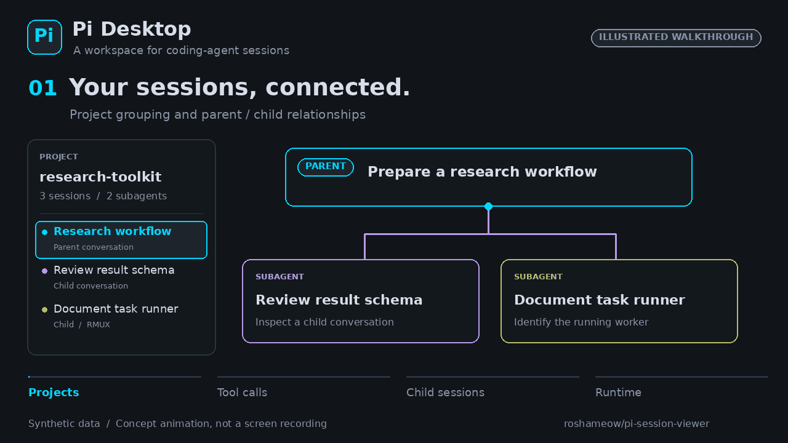

# Pi Desktop

[English](README.en.md) · [源码](https://github.com/roshameow/pi-session-viewer) · [开发说明](docs/development.md)

Pi coding agent 的桌面会话工作台：按项目浏览历史对话，查看父子代理关系，定位运行中的终端，并在桌面窗口继续会话。

## 先看演示



[观看 / 下载 MP4](docs/assets/walkthrough-illustrated.mp4) · [静态图](docs/assets/walkthrough-illustrated.png) · [动画说明与生成脚本](docs/illustrated-walkthrough.md)

这段 20 秒动画使用示例数据和简化图示介绍功能，**不是实际操作录屏**。如需体验真实界面组件，可运行下面的交互演示。

使用合成会话浏览真实的侧边栏与对话组件，不需要安装 Pi、RMUX 或配置模型：

```bash
git clone https://github.com/roshameow/pi-session-viewer.git
cd pi-session-viewer
npm ci
npm run demo
```

打开 `/demo.html`，切换主会话和子代理，展开工具调用并试用搜索/过滤。演示仅展示合成记录，不连接本机会话目录，也不调用模型。

## 桌面功能

- 按工作目录组织会话，浏览消息、thinking、工具调用和输出。
- 将 `pi-subagent-durable` 子会话嵌入父会话列表。
- 区分终端位置与运行状态，支持 RMUX attach/detach。
- 通过本机 Pi 继续会话，复用已配置的模型与扩展。
- 浏览 Agents、Skills 和 MCP 配置，导出会话 HTML。

## 0.1.1 兼容更新

- MCP 清单支持 native `.pi/mcp.json` 与旧 adapter `.mcp.json`；展示来源和 exposure，不冒充实时连接状态或项目 trust。
- 保留 native MCP / codemode / tool_search 工具名，按 `toolCallId` 关联并行与嵌套结果；展开显示完整参数。
- 区分 `ended rmux`（worker 已结束、shell 留存）、`? rmux`（身份未知）与退出 pane；浏览刷新不自动清理窗口或 runtime 文件。
- 续聊仍使用 Pi CLI JSON 模式：对齐会话 cwd，并行读取 stderr 诊断；不覆盖模型、扩展或工具配置。

本次回归使用 mock / fake CLI，不代表真实 MCP、RMUX、SSH 或模型联调通过。

## 安装状态与平台

目前提供源码构建，尚无已验证的正式安装包。不要将本地自签名构建视为已公证的 macOS 发行版。

| 环境 | 当前说明 |
| --- | --- |
| macOS | 主要开发平台；终端标签页助手与辅助功能设置见开发文档 |
| Linux / Windows | 代码含部分平台分支，尚未提供完整桌面功能验证或发行包 |
| 浏览器演示 | 仅合成会话预览，使用 Node.js 22+ |

## 从源码运行

需要 Node.js 22+、Rust 1.88+、[Tauri 系统依赖](https://v2.tauri.app/start/prerequisites/)及本机 Pi。RMUX 用于终端会话管理；需使用该功能时单独安装。

```bash
npm ci
npm run tauri dev
```

macOS 本地打包可运行 `npm run build:unsigned -- --bundles app --ci`（只构建 `.app`，不生成 DMG）；它覆盖开发者证书配置，不需要创建同名私有签名身份。用于分发的签名、公证及系统授权仍需自行处理。已有稳定签名配置的维护者可使用 `npm run tauri -- build --bundles app --ci`。这些命令不会安装或启动应用。

## 隔离验证

```bash
npm run test:adaptation
npm run build
cargo test --offline --manifest-path src-tauri/Cargo.toml adaptation_tests
```

Unix fake CLI 测试需要 Python 3。macOS 如已有 rustup 工具链，可在 Rust 命令前加 `PATH="$HOME/.cargo/bin:$PATH"`；选择已安装的 Rust ≥1.88，无需升级依赖。不要将包含本机数据 / RMUX 测试的全量 `cargo test` 当作隔离验收。

## 开发与反馈

- [实现、签名和历史性能记录](docs/development.md)
- [版本记录](CHANGELOG.md)
- [关联项目：pi-subagent-durable](https://github.com/roshameow/pi-subagent-durable)
- [提交问题](https://github.com/roshameow/pi-session-viewer/issues)：请提供系统、Pi 版本、复现步骤；会话日志请先脱敏。

[MIT](LICENSE)
