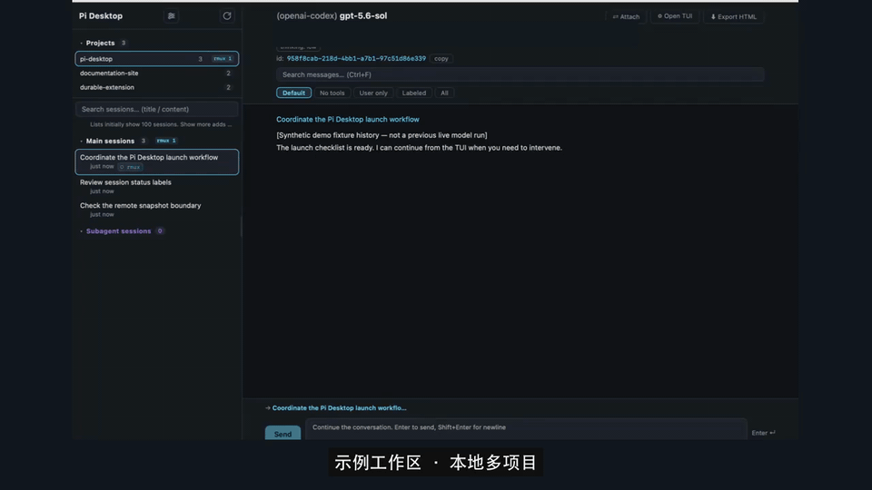

# Pi Desktop

[English](README.en.md) · [源码](https://github.com/roshameow/pi-session-viewer) · [开发说明](docs/development.md)

与 Pi TUI 协同使用的桌面会话工作台：需要深入交互时 attach 到 TUI；Agent 自己干活时 detach，在 Desktop 侧边栏掌握多项目、会话与子代理总览。

## 先看真实演示



[19 秒无声 MP4](docs/assets/native-workflow.zh.mp4) · [PNG 封面](docs/assets/native-workflow.zh.png) · [演示说明与验证](docs/native-walkthrough.md)

完整闭环：**总览 → attach → TUI 交互 → detach → 总览**。这是实际原生 UI 与真实 Pi TUI / RMUX / 模型执行的剪辑，不是 SVG 概念动画；GIF 本身无声。

工作区与种子 history 为合成示例；仅演示本地多项目，不演示实时 remote。放大、高亮与隐私遮罩为后期处理；结尾是任务完成后的独立总览镜头，不代表任务仍在运行。

使用合成会话浏览真实的侧边栏与对话组件，不需要安装 Pi、RMUX 或配置模型：

```bash
git clone https://github.com/roshameow/pi-session-viewer.git
cd pi-session-viewer
npm ci
npm run demo
```

打开 `/demo.html`，切换主会话和子代理，展开工具调用并试用搜索/过滤。演示仅展示合成记录，不连接本机会话目录，也不调用模型。

## 桌面功能

- 按工作目录组织会话，浏览消息、thinking、工具调用和输出。
- 将 `pi-subagent-durable` 子会话嵌入父会话列表。显式父 UUID 支持 worker → grandchild，使用去重后的会话路径（优先真实会话）；缺失、自指、循环或歧义关系不猜测父会话。侧栏主会话分组仍只展示直接子代理，嵌套 worker 的父标签显示在子代理区。
- 区分终端位置与运行状态，支持 RMUX attach/detach。
- 通过本机 Pi 继续会话，复用已配置的模型与扩展。
- 浏览 Agents、Skills 和 MCP 配置，导出会话 HTML。

## 0.1.5 目录切换与远程缓存

会话列表先显示 100 条，使用“显示更多”继续浏览；搜索仍覆盖全部已加载会话，选中的旧会话不会丢失。目录结果按来源与项目复用，旧请求和已取消轮询不会覆盖新目录。

连接有可用缓存的远程主机时先显示缓存，再后台同步；界面显示缓存时间、同步阶段与错误。没有缓存时仍需要首次同步。缓存不是实时状态，同步中或失败时不能保证整个历史／进程快照处于同一个时间点。局域网不能消除首次历史索引和 GUI 渲染成本。

## 0.1.4 会话列表规模与远程来源

列表头部改为有上限的流式读取，只有未标记的旧子代理才触发完整正文的父节点匹配；侧栏父查找使用索引。进程身份按批次验证，远程读取只使用对应主机已同步的快照，不查询本机同号 PID。缓存按来源、目录与快照隔离。

这些优化不删除历史、不关闭 Pi/worker，也不把远程缓存冒充实时状态。首次打开多 GB 历史目录仍可能耗时数秒；内存缓存命中与冷加载必须分别衡量，不能承诺所有目录瞬时加载。

## 0.1.2 运行黄点修复

- 黄点（busy）是**已验证 Pi 身份 + transcript 最后一条有效消息仍 pending** 的兼容推断（user、assistant `toolUse` / toolCall、toolResult），**不是 SDK 实时 `isStreaming`**。已验证 Pi 的长思考或工具执行，不会仅因超过 60 秒未写 JSONL 而失去黄点；最后 assistant 为 stop / error / abort 等完成状态时，不点亮 idle TUI。
- UNKNOWN 身份只允许短暂 fresh transcript 的弱兜底；明确已结束 Pi / 留存 dead shell 仍为 false，不把终端存活当 busy。
- 识别 anchored `pi-subagent-task-*` 进程标题，不匹配 shell / tee 内的文本；正常 `pi_subagent_exit(exitCode=0)` 元信息不掩盖此前 `agent_settled`。
- 远程 PID age guard 使用采集时的源主机时间；旧快照使用固定 snapshot mtime。同步过滤包含 `pi-subagent` 标题，但远程仍是**最近一次手动同步的快照，不是实时状态**。

兼容推断无法全面保证 auto-retry、compaction、超大 / 截断 JSON 或 SSH 降级场景；纯回归和一次本机只读 inventory 不等于 GUI / 远程端到端验收。

## 0.1.1 兼容更新

- MCP 清单支持 native `.pi/mcp.json` 与旧 adapter `.mcp.json`；展示来源和 exposure，不冒充实时连接状态或项目 trust。
- 保留 native MCP / codemode / tool_search 工具名，按 `toolCallId` 关联并行与嵌套结果；展开显示完整参数。
- 区分 `ended rmux`（worker 已结束、shell 留存）、`? rmux`（身份未知）与退出 pane；浏览刷新不自动清理窗口或 runtime 文件。
- 续聊仍使用 Pi CLI JSON 模式：对齐会话 cwd，并行读取 stderr 诊断；不覆盖模型、扩展或工具配置。

本次回归使用 mock / fake CLI，不代表真实 MCP、RMUX、SSH 或模型联调通过。

## 安装状态与平台

目前提供源码构建，尚无已验证的正式安装包。不要将本地自签名构建视为已公证的 macOS 发行版。

| 环境 | 当前说明 |
| --- | --- |
| macOS | 主要开发平台；终端标签页助手与辅助功能设置见开发文档 |
| Linux / Windows | 代码含部分平台分支，尚未提供完整桌面功能验证或发行包 |
| 浏览器演示 | 仅合成会话预览，使用 Node.js 22+ |

## 从源码运行

需要 Node.js 22+、Rust 1.88+、[Tauri 系统依赖](https://v2.tauri.app/start/prerequisites/)及本机 Pi。RMUX 用于终端会话管理；需使用该功能时单独安装。

```bash
npm ci
npm run tauri dev
```

macOS 本地打包可运行 `npm run build:unsigned -- --bundles app --ci`（只构建 `.app`，不生成 DMG）；它覆盖开发者证书配置，不需要创建同名私有签名身份。用于分发的签名、公证及系统授权仍需自行处理。已有稳定签名配置的维护者可使用 `npm run tauri -- build --bundles app --ci`。这些命令不会安装或启动应用。

## 隔离验证

```bash
npm run test:adaptation
npm run build
cargo test --offline --manifest-path src-tauri/Cargo.toml running_diagnostics -- --skip live_running_inventory
cargo test --offline --manifest-path src-tauri/Cargo.toml adaptation_tests
```

Unix fake CLI 测试需要 Python 3。macOS 如已有 rustup 工具链，可在 Rust 命令前加 `PATH="$HOME/.cargo/bin:$PATH"`；选择已安装的 Rust ≥1.88，无需升级依赖。不要将包含本机数据 / RMUX 测试的全量 `cargo test` 当作隔离验收。

## 开发与反馈

- [实现、签名和历史性能记录](docs/development.md)
- [版本记录](CHANGELOG.md)
- [关联项目：pi-subagent-durable](https://github.com/roshameow/pi-subagent-durable)
- [提交问题](https://github.com/roshameow/pi-session-viewer/issues)：请提供系统、Pi 版本、复现步骤；会话日志请先脱敏。

[MIT](LICENSE)
